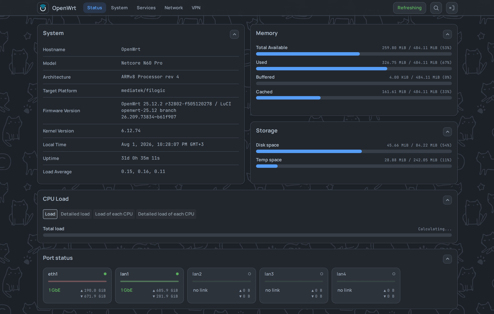

# LUCI-THEME-FOOTSTRAP

**English** · [Русский](README_ru.md) ·
**[Playground — try the whole thing with no router](https://vizzletf.github.io/luci-theme-footstrap/playground.html)**

[](https://owfeed.org/install/)
[](https://owfeed.org/install/)

A LuCI theme for OpenWrt 24.10 and newer. No framework, `luci-base` is the only dependency.

<picture>
  <source media="(max-width: 767px)" srcset="assets/readme/phone-menu-dark.png">
  
</picture>

<details>
<summary>Appearance settings</summary>


</details>

## Install

```sh
wget -qO- https://github.com/VizzleTF/luci-theme-footstrap/releases/latest/download/install.sh | sh
```

The script adds its own package feed and installs from it. After that the theme upgrades with the
router: `apk update && apk upgrade` (or `opkg`).

Then pick **Footstrap** in **System → System → Language and Style**, field "Design".

[More screenshots →](docs/screenshots/)

## What it does

- **Styles every page, stock or not** — but never overwrites what an app styles itself
- **Works on a phone**
- **Faster than bootstrap** — the numbers are below
- **Upgrades with the router**, from the package feed
- **Eighteen appearance axes**, applied instantly, in one tab

## Measured, not claimed

Time to first paint, same router, same pages.

| Page | bootstrap | footstrap |
|---|---:|---:|
| Wireless status | 271 ms | **54 ms** |
| Interfaces | 374 ms | **111 ms** |
| DNS | 329 ms | **108 ms** |
| Firewall zones | 311 ms | **79 ms** |
| 38-page run | 11 306 ms | **4933 ms** |
| Requests/page | 15–47 | **0–7** |

Median page **3.03× faster**, the whole run **2.29×**. Router CPU for the same tour: 37.3 s against
**18.4 s**. Measured on real hardware, five runs — method and full data in
[docs/benchmark.md](docs/benchmark.md).

## Documentation

Developer documentation is in **[docs/](docs/README.md)** — architecture, the design system, the
stylesheet build, the SPA router, packaging, the release runbook. Start with
[architecture.md](docs/architecture.md) for what the theme is, or
[conventions.md](docs/conventions.md) for the rules a patch has to follow.

Writing a `luci-app`? Read
[how to style it so it works under any theme](docs/luci-app-styling-guide.md), and paste your CSS
into the [devkit](https://vizzletf.github.io/luci-theme-footstrap/) — token grid, component markup,
style checker.
